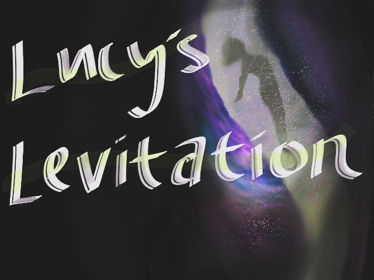

# Lucy's Levitation
## Created by The Cozies

In Lucy's Levitation, you progress through a mysterious temple.

Lucy's Levitation uses a very minimal amount of SM64's assets. Every single texture and model used in the main gameplay were created by us, with the exception of few big obvious ones. Music was created by us, font was handpicked, and objects were created from scratch. Our goal was to make it completely visually unique.

The original goal of this hack on a technical level was to be 100% N64 compatible. While the majority of the game is, unfortunately, a bug with S2D causes an RCP crash on console. This hack will be updated once this bug has been figured out.

## Movement:
*These tips will appear in game, but I'd recommend you look over them to get familiar with the custom controls.*
- **Air:**
    - Groundpound jump. Press A when your ground pound hits the ground.
    - Air dive. Any direction you hold your controller stick, hold Z and press B while in the air to dive that direction. This is a very important mechanic for crossing large gaps in Lucy's Levitation.
    - Air jump. A certain object will allow you to jump again in the air with A.
- **Water:**
    - Move any lateral direction using only the controller stick.
    - Hold A to ascend, and B to descend
    - Water groundpound. Like a normal groundpund, but in water.
    - Water jump. After reaching the surface, press A to jump.
    - Similar movement as Super Mario Sunshine.
- **Camera**
    - C left/right rotates the camera 45 degress.
    - C up/down to move between three different zoom positions.
    - D-pad acts as an analog camera for fine adjustments or looking around.
    - Press R to toggle between close and far, and center focus.
    - Press and release L to center the camera behind Lucy.
    - Hold L and press R to snap the camera to the closest 45 degree angle.
    - Camera will automatically snap perpendicular when walljumping if close enough to the perpendicular angle

## Unique functionality:
- Global fog system. Going underwater or in certain areas will change the fog settings to better fit the environment.
- Water surface type: There are several overlapping segments of water, leading to some new layouts!
- Get the orbs, open the door

## Credits / other functionality:
- S2D Text. The main collectable in the game is narrated by someone2639's text engine! Special thanks to someone2639 for helping me get the font properly imported!
- Puppycam. Fazana's glorious camera system, this way my first time using it and the various ways you can hook into it is awesome. Its a lot easier to customize than the vanilla cam. I've made heavy changes/tweaks to the original controls, and for me it made the camera more natural to SM64, but keeps the improvements Fazana had made.
- anonymous_moose's extended bounds: this temple couldn't function without this change!
- Axollyon, thank you for the S2D directory, the custom skybox code, and for holding the compitition!
- No save files: Games to short and you use save states either way, don't lie

## Todo:
- Audio:
    - Voice over: Lucy's voice should sound quite different
    - Sound effects: replace key item sound effects
- Visual flare:
    - Clear indication when Lucy has a second available jump
    - Facial expressions  & A CUSTOM IDLE ANIMATION THAT DOESN'T LOOK AWKWARD
- Widescreen option
